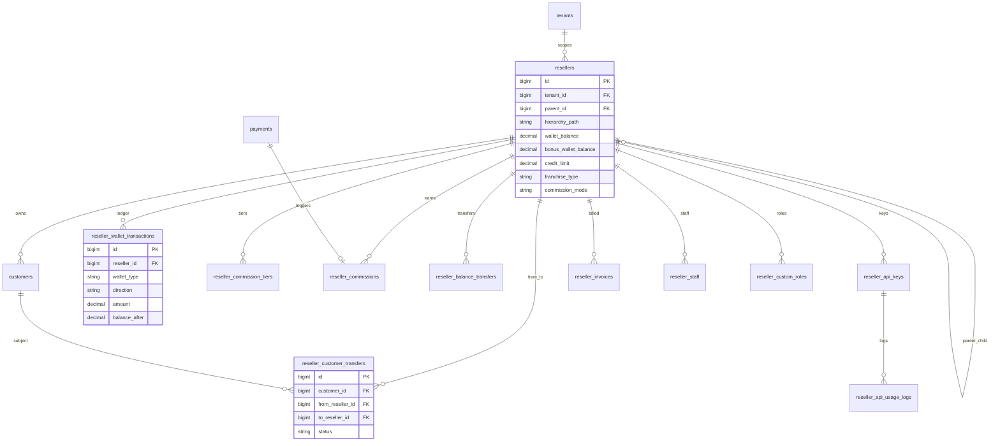

# Reseller Enterprise — ERD

```mermaid
erDiagram
    tenants ||--o{ resellers : scopes
    resellers ||--o{ resellers : parent_child
    resellers ||--o{ customers : owns
    resellers ||--o{ reseller_wallet_transactions : ledger
    resellers ||--o{ reseller_commission_tiers : tiers
    resellers ||--o{ reseller_commissions : earns
    resellers ||--o{ reseller_balance_transfers : transfers
    resellers ||--o{ reseller_api_keys : keys
    resellers ||--o{ reseller_customer_transfers : from_to
    resellers ||--o{ reseller_invoices : billed
    resellers ||--o{ reseller_staff : staff
    resellers ||--o{ reseller_custom_roles : roles
    customers ||--o{ reseller_customer_transfers : subject
    payments ||--o| reseller_commissions : triggers
    reseller_api_keys ||--o{ reseller_api_usage_logs : logs

    resellers {
        bigint id PK
        bigint tenant_id FK
        bigint parent_id FK
        string hierarchy_path
        decimal wallet_balance
        decimal bonus_wallet_balance
        decimal credit_limit
        string franchise_type
        string commission_mode
    }

    reseller_wallet_transactions {
        bigint id PK
        bigint reseller_id FK
        string wallet_type
        string direction
        decimal amount
        decimal balance_after
    }

    reseller_customer_transfers {
        bigint id PK
        bigint customer_id FK
        bigint from_reseller_id FK
        bigint to_reseller_id FK
        string status
    }
```
