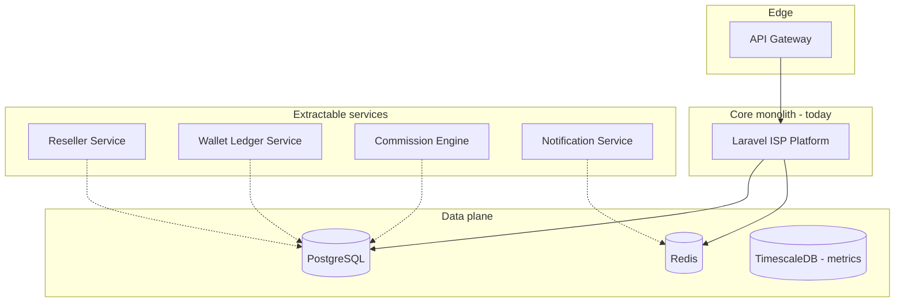

# Reseller Enterprise — Scalable Microservice Design

Monolith-first with clear extraction boundaries for 100+ OLT / 100k+ ONU scale.

## Service boundaries

| Service | Owns | Sync via |
|---------|------|----------|
| **Reseller** | Hierarchy, quotas, branding, transfers | REST/events |
| **Wallet** | Ledger, credit, bonus | Saga + outbox |
| **Commission** | Tiers, accrual, payout | Payment events |
| **Notification** | SMS/email/Telegram | Queue jobs |

## Event topics (future)

- `reseller.wallet.credited`
- `reseller.commission.accrued`
- `reseller.customer.transferred`
- `reseller.suspended.low_balance`

## Why monolith now

Shared `Customer`, `Payment`, `Invoice` models reduce latency for commission accrual. Extract when reseller QPS > 500/s or independent team ownership is required.
